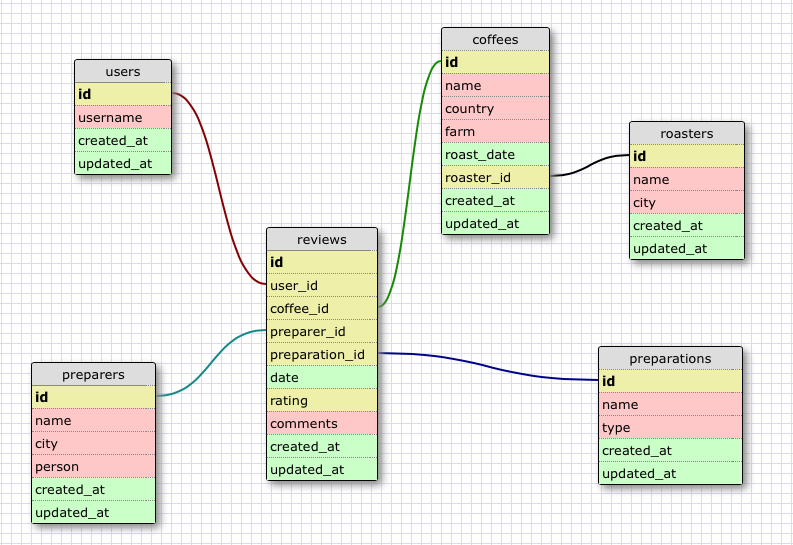

# CoffeeRatings
A simple application for rating and analyzing coffee.

## Motivation
I drink coffee every day, either making it myself or heading to a local coffeeshop. I have some vague ideas of what kinds of coffee and what preparation methods I like the best, but with all of the different places the beans come from and preparers it's hard to pin that down. I'd also love to be able to see how others rate the coffees in other coffeeshops, or other regions of the world so I know which ones to try out. 

CoffeeRatings allows anyone to easily rate of a cup of coffee with as much information as is available about that particular cup, and aggregate the information across users, coffees, and preparations in order to help find additional coffees to seek out.

## Requirements
- A person who drinks coffee can rate that coffee with any amount of data about the coffee, preparation method, and preparer.
- A person who drinks coffee can add new coffees, preparations, roasters, or preparers for their review.
- A user can see the average score of each type of coffee/roaster/preparation method/user in the database.
- A user can see all ratings filtered by user, preparation method, coffee, or roaster.
- A user can compare average scores for each type of coffee/roaster/preparation method/user.

## Schema

